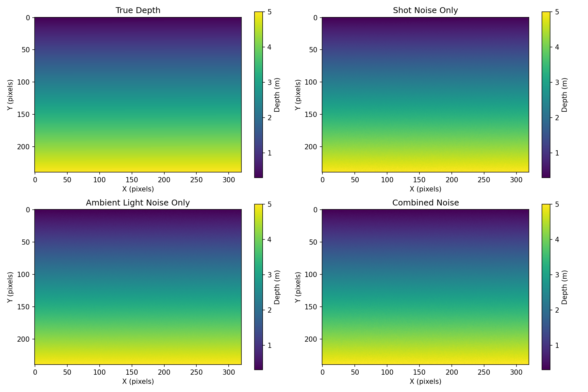
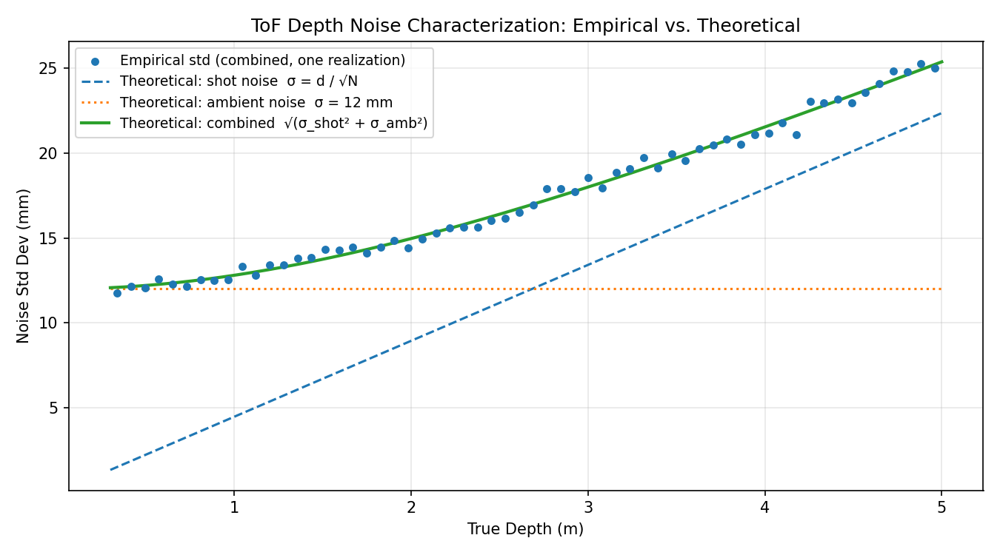
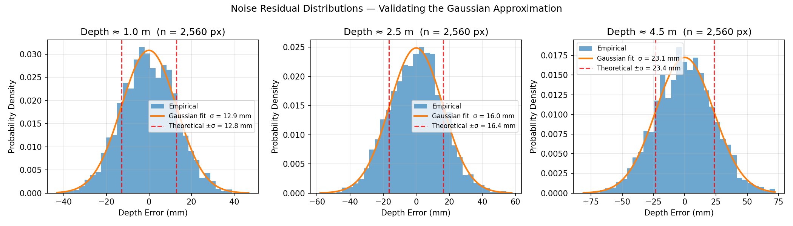
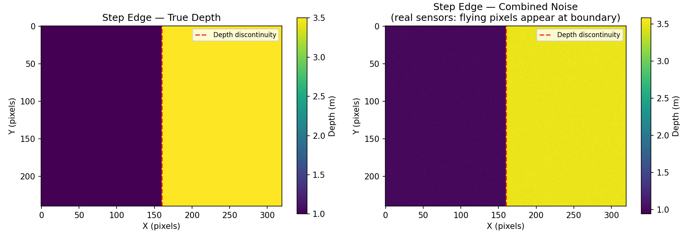

# ToF Depth Sensor Characterization Tool

**Seoho Youn | Optical Systems Engineer | San Jose, CA**

A Python tool for generating synthetic Time-of-Flight (ToF) depth sensor data with
physics-based noise models, characterizing noise as a function of distance, and
validating model assumptions against empirical statistics.

Built as a portfolio project to demonstrate sensor noise modeling, physics-based
simulation, and engineering characterization workflows.

---

## Noise Models Implemented

| Model | Description | Scales with distance? |
|---|---|---|
| **Shot noise** | Poisson photon statistics approximated as Gaussian; σ = d / √N | Yes — grows linearly |
| **Ambient light** | Additive Gaussian from background illumination; spatially uniform | No — constant σ |
| **Combined** | RSS combination of both: σ = √(σ_shot² + σ_ambient²) | Yes |

Key assumptions and known limitations are documented in the module-level docstring
(`data_generator.py`), including the Gaussian-for-Poisson approximation, inverse-square-law
illumination, and the absence of flying-pixel modeling at depth edges.

---

## Output Figures

Running `python data_generator.py` produces four PNG files:

### `noise_comparison.png` — Four-panel depth map comparison
True depth alongside each noise model applied independently, plus the combined result.
All panels share the same color scale so noise magnitude is directly comparable.



### `noise_characterization.png` — Empirical vs. theoretical noise
Noise standard deviation per depth bin (measured from the simulation) plotted against
the analytical curves for shot noise, ambient noise, and their combination. This is the
core sensor-characterization plot — the kind of analysis run on real hardware.



### `residual_histograms.png` — Gaussian approximation validation
Depth error distributions at 1 m, 2.5 m, and 4.5 m, with a fitted Gaussian and
theoretical ±σ lines overlaid. Validates that the Poisson → Gaussian approximation
holds at the chosen photon density.



### `step_edge_scene.png` — Step-edge scene
A foreground plane beside a background plane illustrates where flying-pixel artifacts
occur in real hardware. The model applies noise per-pixel independently and does not
simulate the mixed-depth blending at the boundary.



---

## RMSE Summary (printed to console)

```
====================================================================
   Depth  |    Shot RMSE  |   Ambient RMSE  |   Combined RMSE
--------------------------------------------------------------------
    1.0 m  |       4.4 mm  |        11.8 mm  |         12.9 mm
    2.0 m  |       9.0 mm  |        11.8 mm  |         14.6 mm
    3.0 m  |      13.0 mm  |        12.0 mm  |         18.3 mm
    4.0 m  |      17.9 mm  |        12.1 mm  |         21.3 mm
    5.0 m  |      22.6 mm  |        11.8 mm  |         25.0 mm
====================================================================
```

Shot noise RMSE grows linearly with distance (d / √N). Ambient noise RMSE is
distance-independent. Combined RMSE is dominated by shot noise at long range and by
ambient noise at short range, crossing over at the distance where σ_shot = σ_ambient.

---

## Configurable Parameters

Edit the parameter block at the top of `data_generator.py`:

```python
sensor_height_px         = 240       # vertical resolution
sensor_width_px          = 320       # horizontal resolution
min_depth_m              = 0.3       # nearest measurable distance (m)
max_depth_m              = 5.0       # farthest measurable distance (m)
photon_density_ph_at_1m  = 50_000    # reference photon count at 1 m
                                     # ~10 k  → low-cost ToF (~10 mm std at 1 m)
                                     # ~50 k  → consumer ToF (~4.5 mm std at 1 m)
                                     # ~250 k → industrial ToF (~2 mm std at 1 m)
ambient_noise_std_m      = 0.012     # ambient noise std (m)
                                     # ~0.005 → low-light lab
                                     # ~0.030 → bright outdoor
```

---

## How to Run

```bash
python data_generator.py
```

Requires Python 3.x with NumPy and Matplotlib.

```bash
pip install numpy matplotlib
```

Output is deterministic — `np.random.seed(42)` is set at the top of the script.
Remove or change it to explore different noise realizations.
